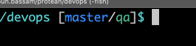

## My Fish 🐟 config

My prompt is very simple. It consists of the current Git branch of the current project,
plus the K8s context I'm using:



The configuration contains some of the aliases I use on a daily basis,
feel free to pick whatever makes you be more productive.

Examples:

### K8s

```fish

# switch between K8s contexes
abbr -a -g kubedev kubectl config use-context <dev-context>
abbr -a -g kubestaging kubectl config use-context <staging-context>
# edit deployments
abbr -a -g edit-deployment kubectl edit deployment <deployment>
# exec to your common pod
function exec-pod
    set pod_id (kubectl get pods -l app=<app> -o custom-columns=":metadata.name")
    kubectl exec -it $pod_id bash
end
function delete-pod
    set pod_id(kubectl get pods -l app=<app> -o custom-columns=":metadata.name" | grep .)
    kubectl delete pod "$pod_id"
end
# display the current deployed image
function current_image
    set image (kubectl get deployment <deployment> -o=jsonpath='{$.spec.template.spec.containers[:1].image}')
    printf "$image\n"
end
```

### Docker

```fish
abbr -a -g drm docker rm
abbr -a -g dri docker images
abbr -a -g dexec docker exec -it
abbr -a -g dstopall docker stop (docker ps -q)
abbr -a -g dps docker ps
abbr -a -g rmidang docker rmi -f (docker images -f "dangling=true" -q)
```

### DB

```fish
# MySQL CLI
alias dev_mysql "mycli -h<host> -uroot -p<pass>"
alias staging_mysql "mycli -h<host> -uroot -p<pass>"
# Flush Redis keys
abbr -a -g flushredis "kubectl get pods -l app=redis -o=name | sed \"s/^.{4}//\" | xargs -I{} sh -c \"kubectl exec {} redis-cli flushall\""
```

You can find more examples in my [Medium](https://faun.pub/some-fish-aliases-for-a-more-productive-programming-a0be12c381dc) post on my Fish aliases.
